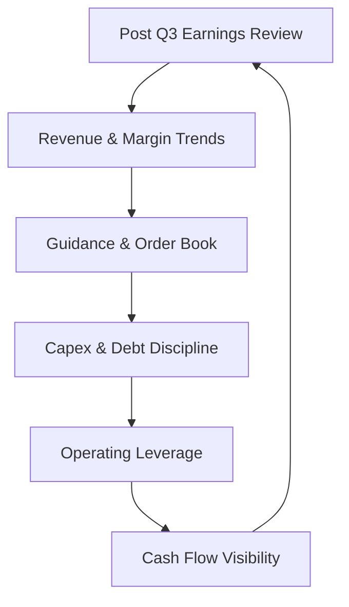

# Post Q3 FY26 Earnings Watchlist: Time to Recalibrate 📊

Q3 FY26 earnings season is largely behind us.

The next phase is not reaction — it is recalibration.  
Capital allocation now depends on execution, guidance, and balance sheet strength.

> Author: Priyanshu Jain, Date: 18-02-2026

---

## 📊 Mainboard Companies Watchlist

Prices as of market close — 18th February 2026.

| Company | Market Price (₹) |
|----------|-----------------|
| Jeena Sikho Life | 717.70 |
| V2 Retail | 2,017.00 |
| Manorama Industries | 1,419.60 |
| Vintage Coffee | 145.05 |
| Yatharth Hospital | 693.35 |
| Sky Gold & Diamonds | 378.40 |
| BlackBuck | 624.85 |
| Frontier Springs | 4,328.65 |
| Arman Financial Services | 1,703.00 |
| Capri Global Capital | 178.52 |
| Kaynes Technology | 4,057.50 |
| Shaily | 2,097.20 |
| Neuland Laboratories | 13,620.00 |
| Coforge | 1,372.80 |
| Quality Power Electrical | 879.35 |
| Cupid | 422.95 |
| Senores Pharmaceuticals | 822.10 |
| Ceinsys Tech | Price Pending |
| Kernex Microsystem | 1,137.60 |
| India Grid Trust | 164.32 |

This basket spans:
- Healthcare
- Diagnostics
- Specialty chemicals
- Electronics manufacturing
- NBFCs
- Retail
- Infra & power
- IT services

Diversification remains thematic, not accidental.

---

## 🏭 MSME Space Watchlist

Higher volatility.  
Higher execution dependency.  
Potentially higher operating leverage.

| Company | Market Price (₹) |
|----------|-----------------|
| Aimtron Electronics | 848.00 |
| Afcom Holdings | 902.05 |
| Chandan Healthcare | 275.85 |
| GSM Foils | 207.90 |
| Z-Tech (India) | 540.25 |
| OBSC Perfection | 311.95 |
| Krishna Defence | 1,129.60 |
| Shanti Gold International | 217.58 |
| V-Marc India | 726.20 |
| Grand Continent | 123.00 |
| Utssav CZ Gold Jewel | 213.45 |
| Bondada Engineering | 341.30 |
| Womancart | 180.00 |
| Sejal Glass | 666.85 |
| Kay Cee Energy & Infra | 133.15 |
| Alpex Solar | 811.95 |

MSME names require:
- Strong balance sheet monitoring
- Working capital discipline
- Order book visibility
- Promoter credibility assessment

Liquidity risk must be priced in.

---

## 📈 What Matters Post Earnings

Post Q3, focus shifts to:
- FY26 guidance vs delivery
- Margin sustainability
- Capex intensity vs cash flow
- Debt trajectory
- Order book execution
- Working capital cycle

Price alone does not determine opportunity.  
Earnings durability does.

---

## ⚖️ Portfolio Allocation Framework

Structured monitoring approach:
- Core compounders → Strong ROCE + steady earnings
- Tactical growth → Expansion-led stories
- High beta bets → MSME / early-stage operators
- Yield stabilisers → InvITs / infra cash flow plays

Rebalancing must be thesis-driven, not price-driven.

---

## 🔍 Final Take

Q3 FY26 provided clarity across sectors.

The next 2–3 quarters will differentiate:
- Narratives vs numbers
- Guidance vs execution
- Expansion vs returns

A disciplined watchlist is not about tracking prices.  
It is about tracking business performance.

---

