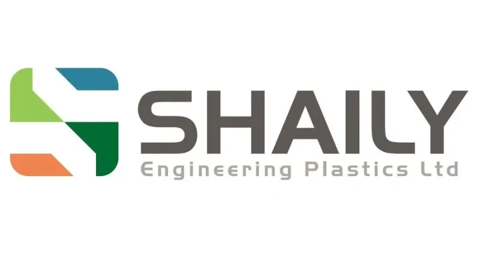
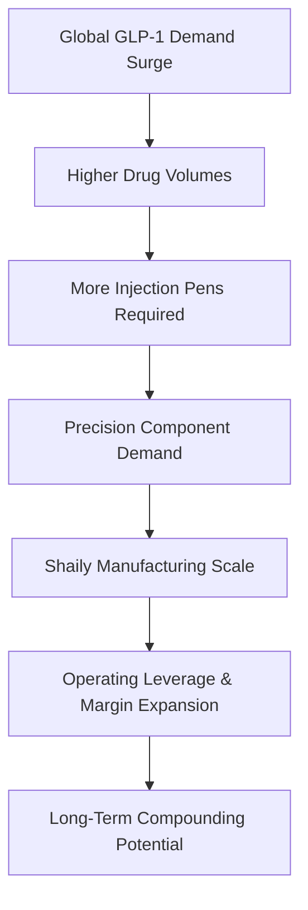

# Shaily Engineering Plastics = The Silent GLP-1 Proxy? 💉

“Tum mote ho? Wazzan kam karna hai?  
Aajao… kara dunga.”

Light humour.

But behind it lies a serious structural opportunity.

As GLP-1 drugs fuel the global weight-loss and diabetes revolution, one Indian manufacturer is quietly building exposure to the delivery ecosystem — **Shaily Engineering Plastics**.

> Author: [Priyanshu Jain](https://in.linkedin.com/in/priyanshujain2032), Date: 21-02-2026

---

## 🌍 The GLP-1 Wave Is Structural

GLP-1 drugs are witnessing exponential global demand driven by:

- Rising obesity levels  
- Increasing diabetes prevalence  
- Strong adoption across US & Europe  
- Expanding physician acceptance  

As drug volumes scale, demand does not stop at the molecule.

It extends to:

- Precision injection pens  
- Drug delivery systems  
- High-spec medical-grade plastic components  

And that’s where the ecosystem players come in.

---

## 🏭 What Shaily Actually Does

Shaily Engineering Plastics is a high-precision plastic components manufacturer serving regulated industries:

- Healthcare & medical devices  
- Pharma delivery systems  
- Consumer & industrial segments  

In the GLP-1 segment, Shaily manufactures critical components used in injection pens — positioning itself as a supplier within a fast-growing therapeutic category.

This is not a typical cyclical industrial story.

It is a **global healthcare trend-driven manufacturing opportunity.**

---

## 💰 Why Device Suppliers Benefit

When GLP-1 drug volumes rise:

- More injection pens are required  
- Component suppliers scale production  
- Long-term supply contracts strengthen  
- High-precision manufacturers gain sticky business  

Unlike drug developers, component suppliers face:

- Lower regulatory volatility  
- More predictable manufacturing scaling  
- Better operating leverage at high utilisation  

The real leverage often sits behind the molecule.

---

## 🚀 Expansion & Strategic Shift

Shaily has been actively:

- Expanding capacity to meet medical device demand  
- Investing in high-margin healthcare verticals  
- Deepening relationships with global pharma & device companies  
- Increasing focus on regulated markets like US & Europe  

The company is gradually shifting revenue mix toward:

- Higher value-added precision healthcare products  
- Longer-term supply contracts  
- Better margin visibility  

---

## 🔥 The Patent Cliff & The Ecosystem Effect

As GLP-1 patents expire and generics enter:

- Drug prices fall  
- Volumes increase  
- Adoption widens globally  

Generic manufacturers may create substitutes.

But injection device ecosystems require:

- Precision  
- Reliability  
- Regulatory compliance  
- Established manufacturing partners  

In the delivery system chain, scale and credibility matter.

And ecosystem leaders tend to consolidate demand.

---

## ⚠️ What To Monitor

- Customer concentration risk  
- Capex execution efficiency  
- Dependency on specific GLP-1 programs  
- Regulatory changes in key export markets  

Structural themes are powerful — but execution determines outcomes.

---

## 🎯 Strategic Positioning

Shaily is not competing in the molecule race.

It is participating in the infrastructure layer of a global healthcare trend.

When a structural health shift meets niche manufacturing capability, long-term compounding potential emerges.

Often, the real opportunity isn’t the theme in headlines —

It’s the proxy behind it.

---

## 🧠 Final Take

The GLP-1 wave is real.

Drug companies may dominate attention.

But component suppliers embedded in the ecosystem may quietly benefit as volumes scale.

Shaily represents a potential backend play on a front-end healthcare revolution.

Execution, capacity utilisation, and customer stickiness will determine whether this remains thematic — or becomes structural compounding.

---

