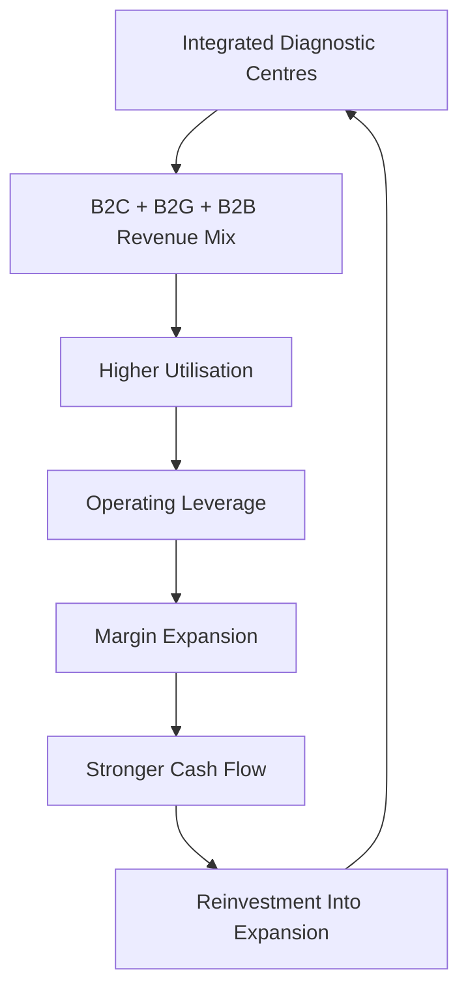

# Chandan Healthcare = Vaibhav Suryaavanshi of Indian Diagnostics? 🏏

Some companies defend.  
Some attack.  

Chandan Healthcare is clearly playing in the powerplay.

> Author: [Priyanshu Jain](https://in.linkedin.com/in/priyanshujain2032), Date: 22-02-2026

---

## 📊 Q3 FY26 Snapshot

| Metric | Value | Growth |
|--------|--------|--------|
| Revenue | ₹65.77 Cr | +20% YoY |
| EBITDA | ₹12.61 Cr | +39% YoY |
| EBITDA Margin | 19.17% | +263 bps |
| PAT | ₹4.54 Cr | — |

> Note: ₹2.2 Cr one-time gratuity impact due to new labour code.

Short-term provisioning aside, operating trajectory reflects improving leverage.

---

## 🏥 Business Model: Not Asset-Light. Infrastructure-Led.

Unlike traditional franchise-heavy chains, Chandan builds **8,000–9,000 sq ft comprehensive centres** offering:

- Pathology  
- Radiology (MRI, CT)  
- Corporate health check-ups  
- Government PPP projects  
- Direct B2C services  
- Franchise network  

Integrated delivery enhances cross-selling, pricing control, and margin potential.

---

## 💰 Segment EBITDA Potential

| Segment | EBITDA Potential |
|----------|------------------|
| B2C (Mature Centres) | 40–45% |
| B2G | 30–40% |
| B2B / Franchise | ~35% |

As centres mature:

- Fixed cost absorption improves  
- Radiology utilisation increases  
- Incremental revenue drops faster to EBITDA  

This is operating leverage in action.

---

## 🚀 Expansion Strategy: Scale With Intent

Recent additions:

- 6 comprehensive centres  
- 18 labs  
- Presence in 13 states  

Pipeline:

- 9 new labs  
- Genome Lab (Lucknow)  
- PET Scan facility (Gorakhpur)  

### Capex Plan
- ₹100 Cr over 3 years  
- ~₹1 Cr per lab  

The model is capital-intensive but margin-accretive at maturity.

---

## 🤝 Jeena Sikho Partnership: Utilisation Upside

- ₹2.5–3 lakh/day revenue currently  
- ~30% coverage  
- Target: 100% coverage within 12 months  

Same infrastructure.  
Higher throughput.  
Improving return ratios.

---

## 🔥 Government Project Trigger: Punjab + Guwahati

- ₹55 Cr annual visibility  
- 10-year contract  
- Direct patient cash collection  

No receivable drag.

If executed efficiently, FY27 growth profile may materially shift upward.

---

## 🎯 Strategic Positioning

Against large chains:

- Higher radiology penetration  
- Comprehensive centre format  
- Corporate affiliations  

Against regional players:

- Brand scale  
- Wider test menu  
- Pricing efficiency  

Positioned between premium nationals and fragmented locals.

---

## 🧠 Final Take

Chandan Healthcare is in expansion mode.

The thesis depends on:

- Utilisation ramp-up  
- Capex discipline  
- Execution efficiency  
- Segment mix optimisation  

If operating leverage materialises as projected, margin expansion could follow.

Execution remains the decisive variable.

