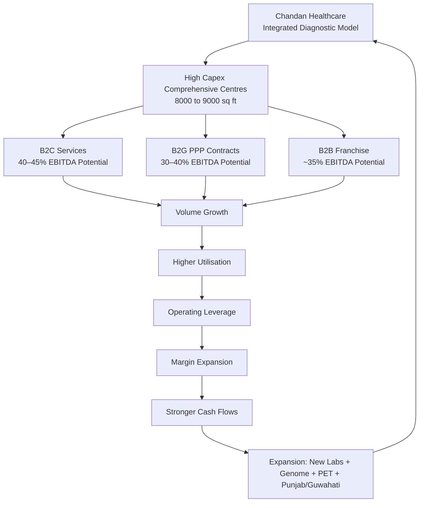

# Chandan Healthcare = Vaibhav Suryaavanshi of Indian Diagnostics? 🏏

Some companies defend.  
Some attack.  

Chandan Healthcare is clearly playing in the powerplay.

> Author: [Priyanshu Jain](https://in.linkedin.com/in/priyanshujain2032) ,Date: 2026-02-22

---

## 📊 Q3 FY26 Snapshot

| Metric | Value | Growth |
|--------|--------|--------|
| Revenue | ₹65.77 Cr | +20% YoY |
| EBITDA | ₹12.61 Cr | +39% YoY |
| EBITDA Margin | 19.17% | — |
| PAT | ₹4.54 Cr | — |

> Note: ₹2.2 Cr one-time gratuity impact due to new labour code.

---

## 🏥 Business Model: Not Asset-Light. Not Minimal.

Unlike traditional asset-light diagnostic chains, Chandan builds **8,000–9,000 sq ft comprehensive centres** offering:

- Pathology  
- Radiology (MRI, CT)  
- Corporate health check-ups  
- Government PPP projects  
- Direct B2C services  
- Franchise network  

Everything under one roof.

---

## 💰 Segment EBITDA Potential

| Segment | EBITDA Potential |
|----------|------------------|
| B2C (Mature Centres) | 40–45% |
| B2G | 30–40% |
| B2B / Franchise | ~35% |

As centres mature → **Operating leverage improves significantly.**

Same infra. Higher utilisation. Better margins.

---

## 🚀 Expansion Mode: ON

- 6 comprehensive centres added  
- 18 labs launched  
- Presence in 13 states  
- 9 new labs launching  
- Genome Lab (Lucknow)  
- PET Scan facility (Gorakhpur)

### Capex Plan
₹100 Cr over 3 years  
~₹1 Cr per lab

---

## 🤝 Jeena Sikho Partnership

- ₹2.5–3 lakh/day revenue currently  
- ~30% utilisation  
- Target: 100% utilisation within 1 year  

If utilisation scales → margin expansion follows.

---

## 🔥 Big Trigger: Punjab + Guwahati Project

- ₹55 Cr annual revenue visibility  
- 10-year contract  
- Cash collected directly from patients  

If executed well — FY27 could look very different.

---

## 🎯 Strategic Positioning

They’re not copying Dr Lal PathLabs.  
They’re building their own integrated format.

Young. Aggressive. Scaling fast.

Like Vaibhav Suryaavanshi —  
Not waiting for the pitch to settle.

---

## 🧠 Final Thoughts

Execution will decide whether ambition converts into sustained profitability.

But one thing is clear:

Chandan Healthcare is not playing defensively.

It’s playing to dominate early overs.

---

### What’s your view on emerging diagnostic players beyond the obvious giants?